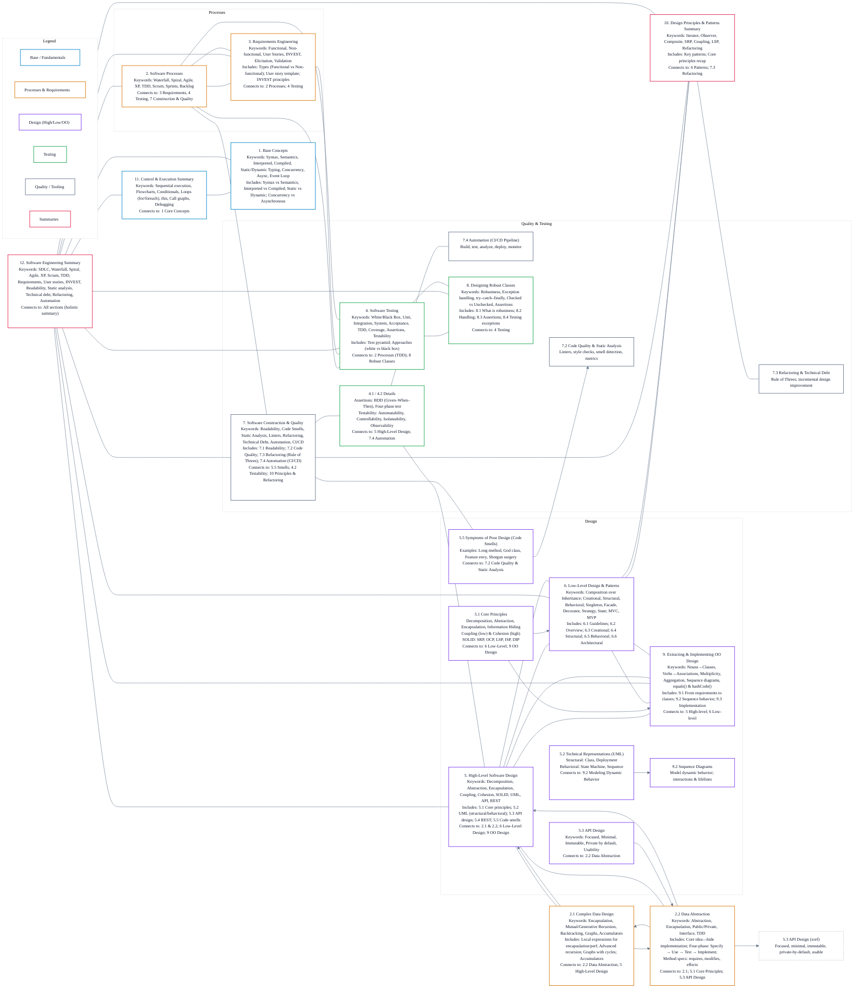

# Software Dev and Programming Core Concepts

<strong>Design Funtions, Data, high Order Functions & Self/Mutual Ref</strong>

- HTDF Step-by-Step Explanation: (Signature, Purpose, Stub)
- HtDD How to design Data - (Form, Representation, Interpretation, Example, Template rules)
- HtDW Design Worlds recipe (Analisis, Constants/Variables, Big Bang functions, recap analysis, implementing/development CD/CI, templates)
- Self-reference (Recursion, Helpers, Binary search trees) & Mutual reference (Complex Data, arbitrary arity trees)

---

<strong>Algorithms & Complexity (Very Short Definitions)</strong>

**Algorithms**  
A step‑by‑step **procedure** for solving a problem or performing a computation.
**Complexity**  
A measure of **time** or **space** an algorithm needs as input size grows.
## Base Structure
- **Input**
- **Process / Steps**
- **Output**
- **Cost analysis** (time & space)
## Most Important Complexity Classes
- **O(1)** – constant  
- **O(log n)** – logarithmic  
- **O(n)** – linear  
- **O(n log n)** – log-linear  
- **O(n²)** – quadratic  
- **O(2ⁿ)** – exponential  
- **O(n!)** – factorial

---

# Software Engineering and Arch Diagram Core Structure

```mermaid
%% ---------------------------------------------------------
%% CI/CD + DevOps + GitHub Flow (white background)
%% Paste directly into GitHub README.md
%% ---------------------------------------------------------
%% Theme: white background
%% Note: GitHub supports Mermaid. This uses the 'base' theme with white bg.
%% ---------------------------------------------------------
%%{init: {'theme':'base','themeVariables': { 'background': 'white' }}}%%

flowchart LR
  %% Direction
  %% flow LR

  %% ========= Agile & Product =========
  subgraph Agile["Agile (Scrum/XP)"]
    BA[Backlog]
    RF[Backlog Refinement]
    SP[Sprint Planning]
    DEV[Implementation]
    TDD[Test-Driven Development]
    REV[Review & Retrospective]
  end

  %% ========= GitHub Flow =========
  subgraph VCS["Version Control (GitHub Flow)"]
    MB[main branch]
    FB[feature/* branch]
    PR[Pull Request]
    CR["Code Review<br/>(& PR checks)"]
    MR[Merge to main]
  end

  %% ========= Testing (Pyramid) =========
  subgraph Testing["Testing (Pyramid)"]
    U[Unit Tests]
    IN[Integration Tests]
    SY[System/End-to-End Tests]
    AC[Acceptance Tests]
    NFR[Non-Functional:<br/>Perf/Sec/Resilience]
  end

  %% ========= Security & Quality Gates =========
  subgraph SecQual["Security & Quality Gates"]
    SAST["Static App Sec Testing (SAST)"]
    SCA["Dependency/License Scan (SCA)"]
    LINT[Linting & Style]
    COV[Coverage Thresholds]
    SEC_POL[Security Policies & Secret Scan]
  end

  %% ========= Build & Artifacts =========
  subgraph Build["Build & Package"]
    CI[Build & Static Analysis]
    ART["Artifact Packaging<br/>(JAR/NPM/Wheel/etc.)"]
    IMG[Container Image Build]
    SBOM[SBOM & Provenance]
    REG[Artifact/Container Registry]
  end

  %% ========= Environments & Delivery =========
  subgraph Delivery["Continuous Delivery/Deployment"]
    DIR["Infra as Code (IaC)<br/>Terraform/Bicep/ARM/CloudFormation"]
    DEV_ENV[Dev Environment]
    STG_ENV[Staging / Pre-Prod]
    CANARY[Canary/Blue-Green Strategy]
    PROD_ENV[Production]
    APPR["Manual Approval (if required)"]
  end

  %% ========= Observability & Ops =========
  subgraph Ops["Operate & Improve"]
    MON[Monitoring & Alerting]
    LOG[Centralized Logs]
    TRC[Tracing & Metrics]
    FEED[User Feedback & Telemetry]
    IM[Incident Mgmt & Postmortems]
    RK[Runbooks & SRE Practices]
  end

  %% ========= Flow: Agile =========
  BA --> RF --> SP --> TDD --> DEV --> REV

  %% ========= Flow: GitHub Flow =========
  DEV --> FB --> PR --> CR --> MR --> MB

  %% ========= CI Trigger =========
  MR -->|push/tag| CI

  %% ========= Testing & Quality Gates in CI =========
  CI --> LINT --> U --> IN --> SY --> AC --> NFR
  CI --> SAST
  CI --> SCA
  CI --> SEC_POL
  U --> COV

  %% ========= Build & Artifacts =========
  CI --> ART --> SBOM --> REG
  ART --> IMG --> REG

  %% ========= Delivery (CD) =========
  MR --> DIR
  DIR --> DEV_ENV
  REG --> DEV_ENV
  DEV_ENV --> STG_ENV

  %% Optional approval gate
  STG_ENV --> APPR --> CANARY --> PROD_ENV
  STG_ENV -->|no-approval -> progressive delivery| CANARY --> PROD_ENV

  %% ========= Observability & Feedback =========
  PROD_ENV --> MON
  PROD_ENV --> LOG
  PROD_ENV --> TRC
  MON --> IM --> RK
  LOG --> IM
  TRC --> IM
  MON --> FEED
  LOG --> FEED
  TRC --> FEED
  FEED --> BA

  %% ========= Notes =========
  %% Pull Request checks typically run the same pipeline subset:
  PR -. triggers .-> CI
  CR -. status checks .-> SecQual
  CR -. status checks .-> Testing

  %% ========= Styling (subtle, still white bg) =========
  classDef light fill:#ffffff,stroke:#d0d7de,stroke-width:1,color:#24292f;
  classDef accent fill:#f6f8fa,stroke:#d0d7de,stroke-width:1,color:#24292f;
  classDef green fill:#e6ffec,stroke:#26a641,stroke-width:1,color:#24292f;
  classDef blue fill:#eef6ff,stroke:#0969da,stroke-width:1,color:#24292f;
  classDef orange fill:#fff1e5,stroke:#d97706,stroke-width:1,color:#24292f;
  classDef purple fill:#f6f0ff,stroke:#8250df,stroke-width:1,color:#24292f;
  classDef red fill:#ffebe9,stroke:#cf222e,stroke-width:1,color:#24292f;

  class Agile,Testing,Build,Delivery,Ops,SecQual,VCS light;

  class BA,RF,SP,DEV,TDD,REV accent;
  class MB,FB,PR,CR,MR blue;
  class CI,ART,IMG,SBOM,REG green;
  class U,IN,SY,AC,NFR purple;
  class SAST,SCA,LINT,COV,SEC_POL orange;
  class DIR,DEV_ENV,STG_ENV,CANARY,APPR,PROD_ENV blue;
  class MON,LOG,TRC,FEED,IM,RK red
```

<strong>1. Base Concepts</strong>

**Keywords:** Syntax, Semantics, Interpreted, Compiled, Static Typing, Dynamic Typing, Concurrency, Asynchronous, Event Loop

- Programming Languages (Syntax vs. Semantics)
- Execution Models (Interpreted vs. Compiled)
- Typing (Static vs. Dynamic)
- Concurrency vs. Asynchronous

---

<strong>2. Software Processes</strong>

**Keywords:** Waterfall, Spiral, Agile, XP, TDD, Scrum, Sprints, Backlog  
**Connects to:** 3. Requirements Engineering, 4. Software Testing, 7. Software Construction & Quality

Traditional Models

- Waterfall (Sequential, Rigid)
- Spiral (Iterative, Risk Analysis)

Agile Methodologies

- Extreme Programming (XP) (Communication, Simplicity, Feedback, Courage, Respect)
- Test-Driven Development (TDD) (Red-Green-Refactor) → Connects to: 4. Software Testing, 7.3 Refactoring
- Scrum (Sprints, Roles: Product Owner, Scrum Master, Team)

2.1 Complex Data Design

**Keywords:** Encapsulation, Mutual Recursion, Generative Recursion, Backtracking, Graphs, Accumulators  
**Connects to:** 2.2 Data Abstraction, 5. High-Level Software Design

- Local Expressions (`local`) for Encapsulation & Performance
- Advanced Recursion (Mutual, Generative, Backtracking)
- Advanced Data Structures (Graphs with Cycles, Accumulators)

2.2 Data Abstraction

**Keywords:** Abstraction, Encapsulation, Public, Private, Interface, TDD  
**Connects to:** 2.1 Complex Data Design, 5.1 Core Principles, 5.3 API Design

- Core Idea (Hiding implementation)
- Four-Phase Design Process (Specify, Use, Test, Implement)
- Method Specification (`requires`, `modifies`, `effects`)

---

<strong>3. Requirements Engineering</strong>

**Keywords:** Functional, Non-functional, User Stories, INVEST, Elicitation, Validation  
**Connects to:** 2. Software Processes, 4. Software Testing

- Types of Requirements (Functional vs. Non-functional)
- User Stories (As a [role], I want [goal], so that [benefit])
- INVEST Principles for User Stories

---

<strong>4. Software Testing</strong>

**Keywords:** White Box, Black Box, Unit, Integration, System, Acceptance, TDD, Coverage, Assertions, Testability  
**Connects to:** 2. Software Processes (TDD), 8. Designing Robust Classes

- Testing Approaches (White Box vs. Black Box)
- The Test Pyramid (Unit, Integration, System, Acceptance)

4.1 Assertions

**Keywords:** BDD (Given-When-Then), Four Phase Test

4.2 Testability Properties

**Keywords:** Automatability, Controllability, Isolateability, Observability  
**Connects to:** 5. High-Level Software Design, 7.4 Automation

---

<strong>5. High-Level Software Design</strong>

**Keywords:** Decomposition, Abstraction, Encapsulation, Coupling, Cohesion, SOLID, UML, API, REST  
**Connects to:** 2.1 & 2.2, 6. Low-Level Design, 9. OO Design

5.1 Core Principles

- Decomposition, Abstraction, Encapsulation, Information Hiding
- Coupling (Low) & Cohesion (High)
- SOLID Principles (SRP, OCP, LSP, ISP, DIP) → Connects to: 6, 9

5.2 Technical Representations (UML)

- Structural Views (Class, Deployment Diagrams)
- Behavioral Views (State Machine, Sequence Diagrams) → Connects to: 9.2

5.3 API Design

**Keywords:** Focused, Minimal, Immutable, Private by Default, Usability  
**Connects to:** 2.2 Data Abstraction

5.4 REST APIs

**Keywords:** Resources, Verbs, Idempotency, Statelessness, Versioning

5.5 Symptoms of Poor Design (Code Smells)

**Connects to:** 7.2 Code Quality & Static Analysis

---

<strong>6. Low-Level Design & Design Patterns</strong>

**Keywords:** Composition over Inheritance, Creational, Structural, Behavioral, Singleton, Facade, Decorator, Strategy, State, MVC, MVP  
**Connects to:** 5. High-Level Software Design, 9. OO Design, 10. Design Principles Summary

6.1 Low-Level Design Guidelines

6.2 Design Patterns Overview

6.3 Creational Patterns (e.g., Singleton)

6.4 Structural Patterns (e.g., Facade, Decorator)

6.5 Behavioral Patterns (e.g., Strategy, State)

6.6 Architectural Patterns (MVC, MVP)

---

<strong>7. Software Construction & Quality</strong>

**Keywords:** Readability, Code Smells, Static Analysis, Linters, Refactoring, Technical Debt, Automation, CI/CD  
**Connects to:** 5.5, 4.2, 10

7.1 Readability & Core Concepts

7.2 Code Quality & Static Analysis (Linters, Code Smells)

7.3 Refactoring & Technical Debt (Rule of Threes)

7.4 Automation (CI/CD Pipeline)

---

<strong>8. Designing Robust Classes</strong>

**Keywords:** Robustness, Exception Handling, `try-catch-finally`, Checked vs. Unchecked Exceptions, Assertions  
**Connects to:** 4. Software Testing

- 8.1. What is Robustness?
- 8.2. Exception Handling
- 8.3. Assertions (for development/debugging)
- 8.4. Testing for Exceptions

---

<strong>9. Extracting & Implementing OO Design</strong>

**Keywords:** Nouns-to-Classes, Verbs-to-Associations, Multiplicity, Aggregation, Sequence Diagrams, `equals()` & `hashCode()`  
**Connects to:** 5. High-Level Software Design, 6. Low-Level Design

9.1 From Requirements to Class Diagram

9.2 Modeling Dynamic Behavior with Sequence Diagrams

9.3 Implementing the Design

---

<strong>10. Design Principles & Patterns Summary</strong>

**Keywords:** Iterator, Observer, Composite, SRP, Coupling, LSP, Refactoring  
**Connects to:** 6. Low-Level Design, 7.3 Refactoring

- Key Patterns (Iterator, Observer, Composite)
- Core Principles Recap (SRP, Coupling, LSP, Refactoring)

---

<strong>11. Control & Execution Summary</strong>

**Keywords:** Sequential Execution, Flowcharts, Conditionals, Loops, `for`, `foreach`, `this`, Call Graphs, Debugging  
**Connects to:** 1. Core Concepts

---

<strong>12. Software Engineering Summary</strong>

**Keywords:** SDLC, Waterfall, Spiral, Agile, XP, Scrum, TDD, Requirements, User Stories, INVEST, Readability, Static Analysis, Technical Debt, Refactoring, Automation  
**Connects to:** All other sections

# Expantion of Software Engineering and Arch Diagram Core Structure (Notes.txt)

## 1. Base Concepts

<strong>Expand</strong>

- **Programming Languages**: Bridge human ideas to computer execution, balancing **syntax** (structure) and **semantics** (meaning).
- **Execution Models**:
  - **Interpreted**: Executes top-down.
  - **Compiled**: Translates code to a lower level before execution, enabling optimizations.
- **Typing**:
  - **Statically Typed**: Types are declared and checked at compile time (e.g., Java).
  - **Dynamically Typed**: Types are tied to runtime values (e.g., JavaScript).
- **Concurrency vs. Asynchronous**:
  - **Concurrency**: Manages multiple simultaneous tasks, often with threads and shared memory (e.g., Java).
  - **Asynchronous**: Handles long-running tasks without blocking the main thread, using an **event loop**, callbacks, and promises (e.g., JavaScript/TypeScript).

## 2. Software Processes

<strong>Expand</strong>

- **Traditional Models**:
  - **Waterfall**: Linear, sequential phases (Requirements -&gt; Design -&gt; Implement -&gt; Verify -&gt; Maintain). Inflexible.
  - **Spiral**: Iterative, with a focus on risk analysis in each cycle.
- **Agile Methodologies**: Prioritize flexibility, customer collaboration, and rapid iterations.
  - **Extreme Programming (XP)**: Focuses on communication, simplicity, feedback, courage, and respect.
  - **Test-Driven Development (TDD)**: A core XP practice. Follows a **Red-Green-Refactor** cycle: write a failing test (Red), write minimal code to pass (Green), and then clean up the code (Refactor).
  - **Scrum**: The most common Agile framework. Work is done in **sprints** (1–3 weeks) by a self-organizing **Team**.
    - **Roles**: **Product Owner** (defines what), **Scrum Master** (facilitates how), **Team** (builds).
    - **Artifacts**: **Product Backlog** (all work), **Sprint Backlog** (work for one sprint).
    - **Ceremonies**: Sprint Planning, Daily Stand-ups, Sprint Retrospective.
- **Traditional Models**:
  - **Waterfall**: Linear, sequential phases (Requirements -&gt; Design -&gt; Implement -&gt; Verify -&gt; Maintain). Inflexible.
  - **Spiral**: Iterative, with a focus on risk analysis in each cycle.
- **Agile Methodologies**: Prioritize flexibility, customer collaboration, and rapid iterations.
  - **Extreme Programming (XP)**: Focuses on communication, simplicity, feedback, courage, and respect.
  - **Test-Driven Development (TDD)**: A core XP practice. Follows a **Red-Green-Refactor** cycle: write a failing test (Red), write minimal code to pass (Green), and then clean up the code (Refactor).
  - **Scrum**: The most common Agile framework. Work is done in **sprints** (1 3 weeks) by a self-organizing **Team**.
    - **Roles**: **Product Owner** (defines what), **Scrum Master** (facilitates how), **Team** (builds).
    - **Artifacts**: **Product Backlog** (all work), **Sprint Backlog** (work for one sprint).
    - **Ceremonies**: Sprint Planning, Daily Stand-ups, Sprint Retrospective.

### 2.1 Complex Data Design

<strong>Expand</strong>

- **Complex Function Design**: For functions with multiple `one-of` type arguments, a "cross-product of type comments table" is used to systematically generate test cases, ensuring all argument combinations are covered.
- **Local Expressions (`local`)**:
    - **Encapsulation**: `local` allows hiding helper functions, exposing only a single public function. This avoids polluting the global namespace and prevents misuse of internal functions.
    - **Performance**: `local` can optimize recursive functions by storing the result of a recursive call in a variable, preventing redundant computations that can lead to exponential time complexity.
    - **Scoping**: `local` introduces lexical scoping, where variables are resolved by searching from the innermost scope outwards.
- **Advanced Recursion Patterns**:
    - **Mutual Recursion**: Used for data structures where two or more types refer to each other, such as arbitrary-arity trees (e.g., a file system). Functions are designed in pairs, with each function handling one of the data types and calling the other in a mutually recursive manner.
    - **Generative Recursion**: A powerful pattern where the recursive call is on a newly generated problem, not a structurally smaller part of the input (e.g., fractals, Hailstone sequence). Requires a formal **termination argument** to prove it will not run forever.
    - **Backtracking Search**: An algorithm for searching tree-like structures. If a path leads to a dead end, the algorithm "backtracks" to try another path. This is often implemented by returning a special value (like `false`) to signal failure.
- **Advanced Data Structures**:
    - **Graphs with Cycles**: Data structures with cycles cannot be represented with simple nested data definitions. The `shared` construct in Racket's Advanced Student language is introduced to define such circular data.
    - **Accumulators**: A design pattern to carry context through a recursive computation. "Context-preserving" accumulators are used when structural recursion loses necessary information, like the index of an element in a list.

### 2.2 Data Abstraction

<strong>Expand</strong>

- **Core Idea**: Data abstraction hides the implementation details of a data structure behind a public interface, separating the "what" from the "how". This is achieved in Java using classes with `public` and `private` visibility modifiers.
- **Four-Phase Design Process**:
    1.  **Specify**: Define the public methods and their behavior using specifications.
    2.  **Use**: Write example code that uses the abstraction to ensure the interface is practical.
    3.  **Test**: Create a comprehensive test suite based on the specification *before* implementation (TDD).
    4.  **Implement**: Write the code to make the tests pass.
- **Method Specification**: A contract for a method, composed of:
    - **`requires`**: Preconditions the caller must satisfy.
    - **`modifies`**: A list of all objects the method changes (mutates).
    - **`effects`**: The observable outcome of the method.
- **Testing from Specifications**: Tests are derived from the specification, especially the `effects` clause. It is crucial to test boundary conditions (e.g., edges of numeric ranges) to catch common off-by-one errors.

## 3. Requirements Engineering

<strong>Expand</strong>

- **Types**:
  - **Functional**: What the system must *do*.
  - **Non-functional**: System properties like performance, usability, or security.
- **User Stories**: A common format for requirements: "As a [role], I want [goal] so that [benefit]."
- **INVEST Principles for User Stories**:
  - **I**ndependent: Can be developed in any order.
  - **N**egotiable: Not a rigid contract; open to discussion.
  - **V**aluable: Delivers clear value to the stakeholder.
  - **E**stimable: Can be sized by the development team.
  - **S**mall: Can be completed within a single iteration.
  - **T**estable: Has clear acceptance criteria.

## 4. Software Testing

<strong>Expand</strong>

- **Goal**: To find the most impactful bugs within given constraints; not to prove the absence of bugs.
- **Testing Approaches**:
  - **White Box**: Uses knowledge of the internal code structure to design tests.
  - **Black Box**: Tests based on the specification without seeing the code. Relies on **Equivalence Class Partitioning (ECP)** and **Boundary Value Analysis** to reduce input space.
- **Testing Levels (The Test Pyramid)**:
  - **Unit Tests**: Test individual functions or components in isolation. Fast and numerous.
  - **Integration Tests**: Verify that multiple components work together correctly.
  - **System Tests**: Test the entire application as a whole, often with synthetic data.
  - **Acceptance Tests**: User-driven validation to confirm the system meets business requirements.
- **Coverage**: A metric indicating how much of the code is executed by tests (e.g., line, branch, path). It helps identify untested code but does not guarantee correctness.

### 4.1. Assertions

<strong>Expand</strong>

- **Purpose**: To verify program behavior against specifications. Not just execution, but correctness.
- **Four Phase Test**: Setup (before/beforeEach), Test (with assertions), Cleanup (after/afterEach).
- **Given-When-Then (BDD)**: Emphasizes readability. "Given a state, When an action occurs, Then assert the outcome."
- **Practical Assertions**: Using expect(actual).to.equal(expected), checking properties (
ot.have.property, have.all.keys), and handling errors (    o.throw).
- **Numerical Assertions**: Use tolerance-based checks for floating-point numbers (e.g.,     o.be.above and     o.be.below).
- **Asynchronous Testing**: Return promises from test cases so the framework waits for resolution.
- **Coverage Reports**: Tools generate HTML reports to show executed code, guiding where more tests are needed, but should not be the sole driver of testing.

### 4.2. Testability Properties

<strong>Expand</strong>

- **Definition**: Modifying a system to facilitate the five testing steps: **Reach** code, **Trigger** defects, **Propagate** results, **Observe** faults, **Interpret** as defect. TDD naturally promotes testability.
- **Automatability**:
  - **Importance**: Enables fast, programmatic execution essential for efficient regression testing. Low per-run cost despite initial setup.
  - **Regression Testing**: Crucial for continuous feedback on quality and quick bug fixing.
  - **Design for Automatability**: Interfaces that allow programmatic input simulation (e.g., Mario's Keys interface).
- **Controllability**:
  - **Definition**: The ability to set up the system in specific states required for testing.
  - **Improving Controllability**: Refactor code to avoid direct dependencies on external resources or complex object creation within constructors. Use dependency injection (e.g., passing pre-configured objects).
- **Isolateability**:
  - **Definition**: The ability to quickly pinpoint the cause of a test failure.
  - **Improving Isolateability**: Break down complex methods or components into smaller, independently testable units. This simplifies debugging by narrowing down failure sources.
- **Observability**:
  - **Definition**: The extent to which program behavior (including triggered faults) can be verified.
  - **Improving Observability**: Modify method signatures to return key computed values or states. This allows internal state to remain private while still being verifiable, improving information hiding.
- **Challenges in Testing**: Tests themselves can have defects (up to 26% of failures). Non-determinism can lead to inconsistent test results.

## 5. High-Level Software Design

<strong>Expand</strong>

- **Goal**: Manage complexity by breaking down a system into understandable and maintainable modules. This is achieved through principled **decomposition** and **abstraction**.
- **Constant Change**: Designs must evolve. It is often better to design for near and medium-term goals rather than attempting to create a "perfect" final design from the start, as requirements and system loads will change over time.

### 5.1. Core Principles

<strong>Expand</strong>

- **Decomposition**: The process of breaking a large system into smaller modules.
  - **Top-Down**: Starts from a high-level system description and progressively breaks it into smaller, more detailed components.
  - **Bottom-Up**: Starts with concrete, low-level components and composes them into larger, more abstract systems, often identifying commonalities to create reusable libraries.
- **Abstraction**: Hiding complex reality while exposing only essential parts. It allows different stakeholders to focus on the aspects relevant to them, ignoring irrelevant detail. It separates *what* a component does from *how* it does it.
- **Encapsulation &amp; Information Hiding**: Encapsulation is the mechanism (e.g., classes) of bundling data with the methods that operate on it. Information Hiding is the design principle of concealing implementation details. A key goal is to separate parts of the system that are likely to **vary** (implementation) from those that should remain **stable** (interface).
- **Coupling**: The degree of interdependence between modules. The goal is **Low Coupling**, achieved by minimizing the number and complexity of interfaces between modules. High coupling is problematic as it makes changes difficult to isolate, hinders code reuse, and complicates understanding the system.
- **Cohesion**: The degree to which elements *within* a single module belong together. The goal is **High Cohesion**, where a module is responsible for a single, well-defined task. Low cohesion makes code harder to understand, maintain, and reuse.
  - **Levels of Cohesion (from best to worst):**
    1.  **Functional**: All elements contribute to a single, essential function (ideal).
    2.  **Sequential**: The output of one element is the input for another.
    3.  **Communicational**: Elements operate on the same data.
    4.  **Procedural**: Elements are grouped because they execute in a specific order (driven by control flow).
    5.  **Temporal**: Elements are grouped because they are processed at the same time (e.g., an initialize() method).
    6.  **Logical**: Elements are logically related, but their functions are different (e.g., a StringUtils class).
    7.  **Coincidental**: Elements have no meaningful relationship; they are grouped arbitrarily (worst).

#### 5.1.1 The SOLID Principles

<strong>Expand</strong>

- A set of five design principles for creating more understandable, flexible, and maintainable object-oriented systems.
- **S - Single Responsibility Principle (SRP)**: A class should have only one reason to change, meaning it should have only one job or responsibility. This leads to smaller, more focused classes.
- **O - Open-Closed Principle (OCP)**: Software entities (classes, modules, etc.) should be open for extension, but closed for modification. This is achieved by relying on abstractions, allowing new functionality to be added by creating new subclasses without changing existing code.
- **L - Liskov Substitution Principle (LSP)**: Subtypes must be substitutable for their base types without altering the correctness of the program. If a class S is a subtype of T, then objects of type T may be replaced with objects of type S without undesirable side effects.
- **I - Interface Segregation Principle (ISP)**: Clients should not be forced to depend on interfaces they do not use. It's better to have many small, client-specific interfaces than one large, general-purpose one.
- **D - Dependency Inversion Principle (DIP)**: High-level modules should not depend on low-level modules. Both should depend on abstractions (e.g., interfaces). Furthermore, abstractions should not depend on details; details should depend on abstractions. This decouples the implementation details from the high-level logic.

### 5.2. Technical Representations

<strong>Expand</strong>

- Software development involves translating an **Idea** into a **Specification**, then into a **Design**, and finally into **Code**. Moving down this path makes the representation more **concrete** by adding detail.
- **Diagrams (e.g., UML)** are the primary tool for representing designs. They must be **concrete, unambiguous, accurate, and precise**.
- **Architectural Views**: A system is often described using multiple diagrams, each providing a different **view** for a different **stakeholder** (e.g., developers, DevOps engineers). Maintaining consistency between these views is critical, and identifying inconsistencies often reveals underlying design flaws.
- **Structural Views** (Static):
  - **Class Diagrams**: Show the static structure: classes, attributes, methods, and relationships. They are the blueprint for the code.
  - **Deployment Diagrams**: Map software components to physical hardware or execution environments. They make the runtime architecture explicit, showing what runs on the client, server, etc.
- **Behavioral Views** (Dynamic):
  - **State Machine Diagrams**: Model the states an object can be in and the events that trigger transitions. They are excellent for designing event-driven systems and preventing invalid state changes (e.g., preventing a character from double-jumping in mid-air).
  - **Sequence Diagrams**: Illustrate object interactions in chronological order. They are useful for understanding the dynamic behavior of a specific feature or use case.

### 5.3. API Design

<strong>Expand</strong>

- **APIs (Application Programming Interfaces)** are formal contracts that enable programmatic interaction. Good design is crucial, as public APIs are "forever" to maintain backward compatibility.
- **Key Design Principles**:
  - **Focused &amp; Minimal**: Do one thing well and be as small as possible.
  - **Hide Implementation**: Do not expose internal details through the API.
  - **Favor Immutability**: Return immutable objects to prevent clients from changing your internal state, and vice versa.
  - **Private by Default**: Only make public what is absolutely necessary for the client.
- **Usability is Key**: An API is a UI for developers.
  - **Visibility**: Make it easy to find what's needed and hard to misuse (e.g., use enums over free-form strings).
  - **Mental Model**: The API's structure should match the developer's mental model of the task.
  - **Mapping**: Use the type system to make the API clear and prevent errors.
  - **Feedback**: Provide immediate and descriptive error messages.
- **Process**: An iterative cycle of 1) writing a clear specification, 2) soliciting feedback, 3) prototyping (using the API in at least three different client contexts), and 4) creating thorough documentation with examples.

### 5.4. REST APIs

<strong>Expand</strong>

- **REST (Representational State Transfer)** is a dominant architectural style for building distributed, stateless web services.
- **Key Concepts**:
  - **Resources (Nouns)**: Identified by unique URIs (e.g., /api/users/123).
  - **Verbs (HTTP Methods)**: Define actions on resources.
    - GET: Retrieve a resource.
    - POST: Create a new resource.
    - PUT: Update/replace an existing resource.
    - DELETE: Remove a resource.
  - **Idempotency**: GET, PUT, and DELETE are idempotent (multiple identical requests have the same effect as one). POST is not idempotent (multiple requests create multiple resources).
  - **Statelessness**: Each request from a client must contain all information the server needs to process it. The server does not store any client application state between requests, which greatly enhances scalability.
  - **Representations**: Data is exchanged in self-descriptive formats like JSON or XML. These are representations of the server's internal state, not the state itself.
- **Evolution &amp; Security**:
  - **Versioning**: APIs must evolve. Use versioning in the URI (/api/v2/users), as a query parameter (?v=2), or in a custom header to allow changes without breaking existing clients.
  - **Authentication**: Verify user identity, often via HTTP Basic Auth, cookies, or token-based systems like OAuth.

### 5.5 Symptoms of Poor Design (Code Smells)

<strong>Expand</strong>

- Indicators that a software design may have underlying problems.
- **Rigidity**: A small change requires a cascade of changes in other parts of the system.
- **Fragility**: A change breaks unexpected parts of the system.
- **Immobility**: A component is so entangled with its original context that it cannot be reused elsewhere.
- **Viscosity**: It is easier to add a hack or workaround than to follow the intended design conventions.
- **Needless Complexity**: The design contains over-engineered or unused abstractions that increase cognitive load.
- **Needless Repetition**: Duplicated code exists, indicating a missing abstraction.
- **Opacity**: The code is hard to understand; its intent is unclear due to poor structure or illogical placement of features.

## 6. Low-Level Design &amp; Design Patterns

<strong>Expand</strong>

### 6.1 Low-Level Design Guidelines

<strong>Expand</strong>

- **Encapsulate What Varies**: Identify aspects of the application that are likely to change and separate them from those that are stable.
- **Program to an Interface, Not an Implementation**: Depend on abstractions (interfaces) rather than concrete classes. This decouples components and makes the system more flexible.
- **Favor Composition Over Inheritance**: Use object composition (containing instances of other classes) to achieve polymorphic behavior and code reuse. It is often more flexible and less brittle than class inheritance.

### 6.2 Design Patterns Overview

<strong>Expand</strong>

- **Definition**: Reusable, well-documented solutions to commonly occurring problems within a given context in software design. They provide a shared vocabulary for developers.
- **Categories**:
  - **Creational**: Deal with object creation mechanisms, trying to create objects in a manner suitable to the situation (e.g., Singleton).
  - **Structural**: Ease the design by identifying a simple way to realize relationships between entities (e.g., Facade, Decorator).
  - **Behavioral**: Identify common communication patterns between objects and realize these patterns (e.g., Strategy, State).

### 6.3 Creational Patterns

<strong>Expand</strong>

- **Singleton**: Ensures a class has only one instance and provides a global point of access to it. It's useful for managing shared resources like a sound manager or database connection, but should be used with caution as it can introduce global state, making code harder to test and reason about.

### 6.4 Structural Patterns

<strong>Expand</strong>

- **Facade**: Provides a unified, high-level interface to a complex subsystem of classes. It simplifies the client's interaction with the subsystem by hiding its internal complexity.
- **Decorator**: Dynamically adds new behaviors or responsibilities to an individual object without altering the behavior of other objects from the same class. It "wraps" the original object, allowing for a flexible alternative to subclassing for extending functionality.

### 6.5 Behavioral Patterns

<strong>Expand</strong>

- **Strategy**: Defines a family of interchangeable algorithms and encapsulates each one. This allows the algorithm to be selected and swapped at runtime, independently from the client that uses it.
- **State**: Allows an object to alter its behavior when its internal state changes. The object appears to change its class. It is used to systematically manage a large number of states and transitions by modeling them as explicit state objects.
- **Strategy vs. State**: While structurally similar, their intent differs. **Strategy** is about *how* an object does something (the algorithm), and it's often fixed. **State** is about *what* state an object is in and *how* it transitions, which is inherently dynamic.

### 6.6 Architectural (Compound) Patterns

<strong>Expand</strong>

- **MVC (Model-View-Controller)**: A pattern that separates the representation of information from the user's interaction with it.
  - **Model**: Manages the application's data and business logic.
  - **View**: Displays the data from the model to the user.
  - **Controller**: Handles user input and translates it into actions to be performed by the model.
- **MVP (Model-View-Presenter)**: A derivative of MVC that improves testability by further decoupling the View.
  - **Model**: Same as MVC.
  - **View**: Becomes a passive interface that is updated by the Presenter. It contains no application logic.
  - **Presenter**: Acts as the middle-man, retrieving data from the Model and formatting it for the View. All presentation logic lives in the Presenter, making it easy to test without a UI. The View and Model are never directly connected.

## 7. Software Construction &amp; Quality

<strong>Expand</strong>

### 7.1 Readability &amp; Core Concepts

<strong>Expand</strong>

- Software construction is the implementation phase that bridges design and deployment.
- **Readability**: Code is read more often than it is written, so it must be clear. Good naming, consistent style, and logical structure make code its own best documentation. Avoid deep nesting and obscure names.

### 7.2 Code Quality &amp; Static Analysis

<strong>Expand</strong>

- **Code Smells**: Symptoms of deeper design problems (e.g., **Bloaters** like long methods, **OO Abusers** like switch statements instead of polymorphism, **Change Preventers** that make evolution difficult).
- **Static Analysis**: Analyzing code without executing it. **Linters** are tools that detect bugs, enforce code style, and flag suspicious constructs (e.g., assignments in conditional statements).

### 7.3 Refactoring &amp; Technical Debt

<strong>Expand</strong>

- **Technical Debt**: The implied cost of rework caused by choosing an easy solution now instead of a better approach that would take longer.
- **Refactoring**: The process of restructuring existing code *without* changing its external behavior. It is used to improve design, clean up code, and pay down technical debt. It is not for fixing bugs or adding features. A comprehensive test suite is essential for safe refactoring.
- **Rule of Threes**: A guideline for when to refactor: the first time you do something, just do it. The second time, duplicate it but take note. The third time, refactor.

### 7.4 Automation

<strong>Expand</strong>

- Modern software development relies on automation to make processes **reliable, repeatable, and revertible**.
- **Automated Pipeline**: A typical CI/CD (Continuous Integration/Continuous Deployment) pipeline includes automated steps for:
  1.  Fetching code and dependencies.
  2.  Building the project.
  3.  Running tests.
  4.  Deploying to a server.
- Each step provides a fast feedback loop to developers if something fails.

## 8. Designing Robust Classes

<strong>Expand</strong>

### 8.1 What is Robustness?

<strong>Expand</strong>

- The ability of a system to be resilient and recover from strange or unforeseen states, rather than crashing. The goal is to plan for failure and handle it gracefully.

### 8.2 Exception Handling

<strong>Expand</strong>

- **Purpose**: A mechanism to recover from exceptional runtime situations. When an error occurs, a method can     hrow an exception, which propagates up the call stack until it is catched by an appropriate handler. If uncaught, the program terminates.
- **    ry-catch-finally**:
  -     ry: Contains code that may throw an exception.
  - catch: Handles a specific exception type. Multiple catch blocks can be used to handle different types.
  - inally: Contains cleanup code that **always** executes, regardless of whether an exception was thrown or caught.
- **Checked vs. Unchecked Exceptions**:
  - **Checked**: Subclasses of Exception. The compiler forces you to handle them (with a     ry-catch or a     hrows declaration). Used for recoverable, anticipated errors (e.g., file not found).
  - **Unchecked**: Subclasses of RuntimeException. The compiler does not enforce handling. Used for programming errors that should not be caught (e.g., NullPointerException, ArrayIndexOutOfBoundsException).
- **Exception Hierarchy**: Custom exceptions can be created by extending Exception or its subclasses, allowing for more specific error handling and the ability to catch general categories of exceptions.

### 8.3 Assertions

<strong>Expand</strong>

- **Purpose**: A development and debugging tool to verify that the internal state of a program is correct. Assertions are used to check for things that "should never happen." They validate preconditions, postconditions, and class invariants.
- **Mechanism**: An  ssert statement checks a boolean condition. If the condition is false, it throws an AssertionError, halting execution.
- **Usage**: Assertions are intended for development and testing only. They can and should be disabled in production code to avoid any performance impact.

### 8.4 Testing for Exceptions

<strong>Expand</strong>

- An important part of testing is verifying that the code correctly throws exceptions under invalid or exceptional conditions.
- A common pattern in unit tests is to use a     ry-catch block:
  - When an exception **is expected**, the test calls the code in the     ry block. The corresponding catch block allows the test to pass. If the expected exception is *not* thrown, the test should be explicitly failed.
  - When an exception is **not expected**, any exception caught by a catch block should fail the test.

## 9. Extracting &amp; Implementing OO Design

<strong>Expand</strong>

### 9.1 From Requirements to Class Diagram

<strong>Expand</strong>

- **Identifying Classes**: A common technique is to analyze textual requirements (e.g., user stories) and identify all **nouns** as candidate classes.
- **Identifying Associations**: **Verbs** in the requirements describe interactions between nouns, which translate to associations (relationships) between classes. These are represented as fields.
- **Multiplicity**: Indicates how many objects are linked (e.g., 1, * for many). A List&lt;Type&gt; field implies a to-many relationship.
- **Aggregation**: A "part-of" relationship (e.g., a Car has-a Wheel), shown with a diamond, indicating that one class owns or contains another.
- **Bidirectional Association**: When two classes have fields referencing each other, shown with a line with no arrowheads.

### 9.2 Modeling Dynamic Behavior with Sequence Diagrams

<strong>Expand</strong>

- **Purpose**: To visualize how objects interact over time to accomplish a task. They are excellent for understanding and implementing the logic within a method.
- **Components**:
  - **Lifelines**: Vertical lines representing an object's existence.
  - **Method Calls**: Horizontal arrows between lifelines.
  - **Activation Bars**: Rectangles showing when a method is executing.
- They can model control flow like loops (loop frames) and conditionals ( lt frames).

### 9.3 Implementing the Design

<strong>Expand</strong>

- **Fields &amp; Collections**: Associations from the class diagram are implemented as fields. A to-many relationship is implemented using a collection like List, Set, or Map.
- **equals() and hashCode()**: When using custom objects as keys in a HashMap or storing them in a HashSet, you **must** override equals() and hashCode(). Otherwise, the collection will not be able to find objects correctly, as it depends on these methods for value equality, not just reference equality (==).
- **Bidirectional Relationships**: To avoid infinite loops when linking two objects (e.g., student.addCourse(c) which calls c.addStudent(s)), each  dd method must include a guard condition to check if the link already exists before proceeding (e.g., if (!this.courses.contains(c))).

## 10. Design Principles &amp; Patterns Summary

<strong>Expand</strong>

- **Design Patterns**: Reusable, principled solutions for common object-oriented design problems. Key patterns include Iterator, Observer, and Composite.
- **Iterator Pattern**: Abstracts the logic of traversing a collection into a separate Iterator object (hasNext, 
ext). Allows iterating over custom collections without exposing their internal structure. Can be implemented as an inner class for access to private data.
- **Observer Pattern**: Defines a one-to-many dependency where a Subject notifies multiple Observers of state changes. Java provides Observable (class) and Observer (interface). Notifications can be "pushed" (with data) or "pulled" (requiring the observer to fetch data).
- **Composite Pattern**: Allows clients to treat individual objects (Leaf) and compositions of objects (Composite) uniformly through a shared Component interface. Simplifies handling of hierarchical structures like a tree.
- **Core Principles &amp; Refactoring**:
    - **Single Responsibility Principle (SRP)**: Each class should have high **cohesion** and a single, well-defined purpose.
    - **Coupling**: Aim for **low coupling** between modules to minimize the impact of changes.
    - **Liskov Substitution Principle (LSP)**: Subtypes must be fully substitutable for their parent types without altering program correctness.
    - **Refactoring**: The practice of restructuring code to improve internal quality (readability, cohesion) without changing external behavior, enabled by a solid test suite.

## 11. Control &amp; Execution Summary

<strong>Expand</strong>

*   **Execution Flow**: Imperative code in Java executes sequentially, statement by statement, unlike the nested evaluation of functional programming. Flowcharts are used to visualize this sequential and conditional flow.
*   **Conditional Logic**: if-else statements control which blocks of code execute based on a boolean condition.
*   **Iteration (Loops)**:
    *   oreach loop: Iterates over each element in a collection (e.g., a list or array).
    *   or loop: A more general loop that repeats a block of code a specific number of times, managed by an initializer, a condition, and an incrementer.
*   **Object-Oriented Concepts**:
    *   **Classes &amp; Objects**: A class is a template (blueprint) containing data (fields) and behaviors (methods). An object is a specific instance of a class, created using the 
ew keyword and a constructor.
    *   **Constructors**: Special methods that initialize a new object's state. They share the same name as the class.
    *   **Data Flow**: Primitive types (like int) store values directly. Object variables store references (pointers) to memory locations. Assigning one object variable to another copies the reference, not the object itself. The     his keyword is used within an object to refer to its own fields.
*   **Code Structure &amp; Analysis**:
    *   **Call Graphs**: Visual diagrams that trace method calls to understand program behavior and dependencies, starting from an entry point like the main method or a user interaction handler.
    *   **Variables**: Must be declared with a type (e.g., int, String, Dog). They hold either primitive values or references to objects.
*   **Debugging**: A systematic process of finding and fixing bugs.
    *   **Techniques**: Use a hypothesis-driven approach. Set breakpoints to pause execution and inspect the state of variables and fields. Step into, over, or out of methods to trace the flow of control.
    *   **Common Bugs**: Forgetting to initialize fields, incorrect logic in conditionals, off-by-one errors in loops, and NullPointerException from calling methods on 
ull objects.

## 12. Software Engineering Summary

<strong>Expand</strong>

*   **Software Development Lifecycles**:
    *   **Traditional Models**:
        *   **Waterfall**: A rigid, sequential process flowing from requirements to maintenance. Lacks flexibility.
        *   **Spiral**: An iterative model that adds risk analysis and prototyping to the waterfall structure, allowing for customer feedback in year-long cycles.
    *   **Agile Methodologies**: Prioritize flexibility, customer feedback, and rapid iteration.
        *   **XP (Extreme Programming)**: Based on communication, simplicity, feedback, courage, and respect.
        *   **Scrum**: The most popular agile framework. Work is organized into **sprints** (1-3 weeks) with a clear **Product Owner**, **Scrum Master**, and **Team**.
        *   **TDD (Test-Driven Development)**: A practice of writing failing tests *before* writing code, following a "Red-Green-Refactor" cycle.
*   **Requirements Engineering**:
    *   **Process**: An iterative cycle of gathering (elicitation), analyzing, formalizing (
eification), and validating requirements with stakeholders.
    *   **User Stories**: A common format for capturing requirements ("As a [role], I want [goal], so that [benefit]"). Good user stories follow the **INVEST** guidelines (Independent, Negotiable, Valuable, Estimable, Small, Testable).
*   **Software Construction &amp; Quality**:
    *   **Readability**: Code should be self-documenting, with clear names and consistent style.
    *   **Static Analysis**: Tools like linters analyze code without running it to find bugs, enforce style, and identify code smells (symptoms of poor design).
    *   **Technical Debt &amp; Refactoring**: **Technical debt** is the long-term cost of short-term compromises. **Refactoring** is the process of improving code's internal structure without changing its external behavior, effectively "paying down" technical debt.
    *   **Automation**: Automating the build, test, and deployment process is key to creating reliable, repeatable, and revertible software delivery pipelines.

